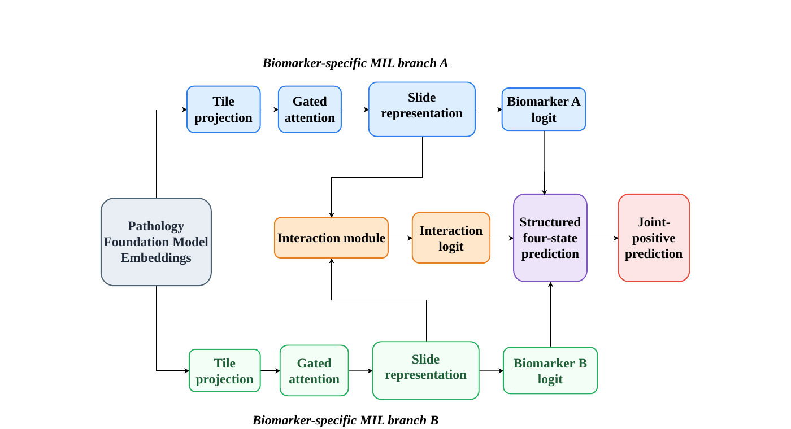

# State-Aware Interaction MIL

Code accompanying **“State-Aware Interaction MIL for Rare Joint Molecular Phenotype Prediction in Colorectal Cancer and Lung Adenocarcinoma.”**

State-Aware Interaction MIL is a weakly supervised framework for predicting rare co-occurring molecular phenotypes from whole-slide histology. The method preserves biomarker-specific slide representations, explicitly models their interaction, and supervises the complete four-state molecular configuration instead of collapsing all non-joint states into a single negative class.

<p align="center">
  
</p>

## Method

Let a patient be represented by a bag of frozen pathology foundation-model tile embeddings

$$
X=\{x_1,\ldots,x_N\}, \qquad x_i\in\mathbb{R}^{D}.
$$

For two binary biomarkers $A,B\in\{0,1\}$, the molecular state is

$$
y_s = 2A+B \in \{0,1,2,3\},
$$

corresponding to

$$
00,\;01,\;10,\;11,
$$

where state $11$ is the joint-positive phenotype.

Two separately parameterized gated-attention MIL branches produce biomarker-specific slide representations

$$
z_A=\mathrm{MIL}_A(X), \qquad z_B=\mathrm{MIL}_B(X),
$$

with $z_A,z_B\in\mathbb{R}^{256}$. Biomarker-specific heads produce logits

$$
a=f_A(z_A), \qquad b=f_B(z_B).
$$

The interaction representation is

$$
u=[z_A,\;z_B,\;z_A\odot z_B,\;|z_A-z_B|]\in\mathbb{R}^{1024},
$$

and an interaction MLP produces

$$
i=g(u).
$$

The four structured molecular-state logits are

$$
q=[q_{00},q_{01},q_{10},q_{11}]
  =[0,\;b,\;a,\;a+b+i].
$$

Thus, when $i=0$,

$$
q_{11}=a+b,
$$

while a learned nonzero interaction term allows the joint-positive logit to depart from the additive combination of the biomarker-specific logits.

State probabilities are

$$
p=\mathrm{softmax}(q),
$$

and the final joint-positive prediction is

$$
p_{\mathrm{joint}}=p_{11}.
$$

The training objective combines class-weighted four-state cross-entropy with auxiliary biomarker-specific supervision:

$$
\mathcal{L}
=
\mathcal{L}_{\mathrm{state}}
+
0.25\frac{\mathcal{L}_{A}+\mathcal{L}_{B}}{2}.
$$

## Experimental setting

| Cohort | Joint phenotype | Patients | Joint-positive prevalence |
|---|---|---:|---:|
| TCGA-COAD+READ | BRAF+/MSI+ | 443 | 6.8% |
| TCGA-LUAD | EGFR+/TP53+ | 428 | 8.6% |

Frozen pathology foundation-model representations:

- **UNI2-h:** 1536-D
- **CONCH:** 512-D

The reported experiments use five fixed patient-level outer folds, a 15% inner validation split stratified by molecular state, up to 3,000 training tiles per patient, all available embeddings for validation/testing, AdamW optimization, and validation-AP checkpoint selection.

## Main results

Values are mean ± SD across five outer folds.

### TCGA-COAD+READ — BRAF+/MSI+

| Representation | Method | AUROC | AP |
|---|---|---:|---:|
| UNI2-h | DirectJoint | 0.8998 ± 0.0580 | 0.4489 ± 0.1479 |
| UNI2-h | IndependentPair | 0.9090 ± 0.0726 | 0.4864 ± 0.1146 |
| UNI2-h | NaiveMTL | **0.9096 ± 0.0627** | 0.5161 ± 0.1531 |
| UNI2-h | PostHoc-LR | 0.9093 ± 0.0776 | 0.4907 ± 0.1122 |
| UNI2-h | **State-Aware** | 0.9080 ± 0.0965 | **0.5566 ± 0.2015** |
| CONCH | DirectJoint | 0.8780 ± 0.0565 | 0.3932 ± 0.0658 |
| CONCH | IndependentPair | 0.8372 ± 0.0605 | 0.3448 ± 0.0916 |
| CONCH | NaiveMTL | 0.8269 ± 0.0317 | 0.3225 ± 0.0502 |
| CONCH | PostHoc-LR | 0.8441 ± 0.0622 | 0.3430 ± 0.1020 |
| CONCH | **State-Aware** | **0.8876 ± 0.0473** | **0.4410 ± 0.0446** |

### TCGA-LUAD — EGFR+/TP53+

| Representation | Method | AUROC | AP |
|---|---|---:|---:|
| UNI2-h | DirectJoint | 0.6264 ± 0.1122 | 0.1928 ± 0.1262 |
| UNI2-h | IndependentPair | 0.6842 ± 0.1476 | 0.2525 ± 0.1347 |
| UNI2-h | NaiveMTL | 0.6485 ± 0.1724 | 0.2202 ± 0.1820 |
| UNI2-h | PostHoc-LR | **0.6894 ± 0.1459** | 0.2177 ± 0.1224 |
| UNI2-h | **State-Aware** | 0.6725 ± 0.1746 | **0.2784 ± 0.1714** |
| CONCH | DirectJoint | 0.5292 ± 0.1481 | 0.1226 ± 0.0728 |
| CONCH | IndependentPair | 0.4926 ± 0.0869 | 0.1012 ± 0.0178 |
| CONCH | NaiveMTL | 0.4996 ± 0.1063 | 0.1101 ± 0.0345 |
| CONCH | PostHoc-LR | 0.4990 ± 0.1033 | 0.1049 ± 0.0219 |
| CONCH | **State-Aware** | **0.5725 ± 0.1285** | **0.1659 ± 0.1078** |

Across the four cohort × representation combinations, State-Aware achieved the largest AP among DirectJoint, IndependentPair, NaiveMTL, and PostHoc-LR. With CONCH, it also achieved the largest mean AUROC in both cohorts.

## FourState-ABMIL comparison

To test whether conventional four-state supervision alone explains the observed performance, we additionally compare against FourState-ABMIL, which uses a single gated-attention MIL encoder followed by an unconstrained four-class linear head.

| Cohort | Representation | FourState-ABMIL AUROC / AP | State-Aware AUROC / AP |
|---|---|---|---|
| TCGA-COAD+READ | UNI2-h | 0.8978 / 0.4965 | **0.9080 / 0.5566** |
| TCGA-COAD+READ | CONCH | 0.8532 / 0.3859 | **0.8876 / 0.4410** |
| TCGA-LUAD | UNI2-h | 0.6542 / 0.2418 | **0.6725 / 0.2784** |
| TCGA-LUAD | CONCH | 0.5550 / 0.1529 | **0.5725 / 0.1659** |

State-Aware was above FourState-ABMIL in both AUROC and AP in all four comparisons, indicating that four-state supervision alone did not reproduce the complete State-Aware formulation.

## Component ablation

| Cohort | Variant | UNI2-h AUROC / AP | CONCH AUROC / AP |
|---|---|---|---|
| TCGA-COAD+READ | Full State-Aware | **0.9080 / 0.5566** | **0.8876 / 0.4410** |
| TCGA-COAD+READ | No interaction | 0.9038 / 0.5178 | 0.8281 / 0.3039 |
| TCGA-COAD+READ | No auxiliary supervision | 0.9009 / 0.4604 | 0.8611 / 0.3604 |
| TCGA-COAD+READ | Binary joint supervision | 0.8786 / 0.4542 | 0.8546 / 0.3920 |
| TCGA-LUAD | Full State-Aware | 0.6725 / **0.2784** | 0.5725 / 0.1659 |
| TCGA-LUAD | No interaction | **0.7107** / 0.2604 | 0.5561 / **0.1882** |
| TCGA-LUAD | No auxiliary supervision | 0.6467 / 0.2553 | **0.5923** / 0.1665 |
| TCGA-LUAD | Binary joint supervision | 0.6455 / 0.2079 | 0.4872 / 0.1063 |

Replacing four-state supervision with binary joint supervision reduced both AUROC and AP in both cohorts and with both foundation-model representations. The effects of the interaction and auxiliary-supervision components varied across cohort and representation.

## Four-state molecular separation

Using out-of-fold State-Aware UNI2-h predictions, joint-positive scores differed across the four true molecular states in both cohorts.

- **TCGA-COAD+READ:** Kruskal-Wallis $H=96.19$, $p=1.02\times10^{-20}$. Median $p_{\mathrm{joint}}$ values for states `00/01/10/11` were `0.0011 / 0.1628 / 0.0868 / 0.2758`.
- **TCGA-LUAD:** Kruskal-Wallis $H=20.75$, $p=1.19\times10^{-4}$. Median $p_{\mathrm{joint}}$ values for states `00/01/10/11` were `0.0307 / 0.0415 / 0.0590 / 0.0651`.

In TCGA-COAD+READ, the joint-positive state remained significantly above all three alternative states after Benjamini-Hochberg correction. In TCGA-LUAD, the joint-positive state was significantly above the double-negative and TP53-only states, while overlapping with the EGFR-only state.

## Installation

```bash
git clone https://github.com/raajuuu1998/StateAwareMIL.git
cd StateAwareMIL
pip install -e .
```

## Reproducing experiments

Main State-Aware experiment:

```bash
python -m experiments.run_state_aware \
  --config configs/crc_braf_msi.yaml \
  --fm uni2 \
  --manifest /path/to/manifest.csv \
  --embedding-dir /path/to/embeddings \
  --output-dir outputs
```

Baselines:

```bash
python -m experiments.run_baselines \
  --config configs/crc_braf_msi.yaml \
  --fm uni2 \
  --method all \
  --manifest /path/to/manifest.csv \
  --embedding-dir /path/to/embeddings \
  --output-dir outputs
```

FourState-ABMIL and component ablations are available through:

```text
experiments/run_fourstate_abmil.py
experiments/run_ablations.py
```

Additional reproduction details are provided in [`docs/reproduction.md`](docs/reproduction.md), and the numerical paper summaries are available in [`results/`](results/).

## Data

TCGA whole-slide images, molecular labels, pretrained foundation-model weights, and extracted patient embeddings are not redistributed with this repository. See [`docs/data_setup.md`](docs/data_setup.md) for the expected manifest and embedding formats.

## Citation

If you use this implementation, please cite the accompanying manuscript. Citation information will be updated following publication.
